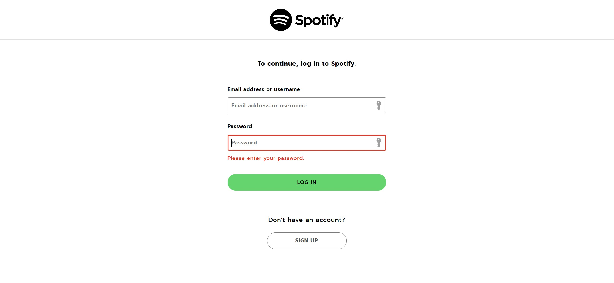

# Tugas Besar 1 IF3110 Pengembangan Aplikasi Berbasis Web

## Deskripsi Aplikasi Web
Pada tugas kali ini, kami membuat aplikasi Web Binotify yang merupakan aplikasi musik berbasis web. Aplikasi ini dikembangkan dengan memanfaatkan sebuah DBMS, PHP murni, beserta HTML, CSS, dan Javascipt vanilla.

## Requirement
PHP, Docker

## Cara Instalasi dan Menjalankan Server
### Menjalankan secara lokal
1. Masuk ke folder src dengan ```cd src``` (jika struktur folder seperti repository ini)
2. Ketikkan command ```php -S localhost:8080```
3. Server telah berjalan pada http://localhost:8080/

### Menjalankan dengan menggunakan docker
1. Masuk ke dalam folder repository
2. Jalankan command ```docker build -t tubes-1:latest .```
3. Jalankan command ```docker compose up```
4. Server telah berjalan pada http://localhost:8080/

## Screenshoot Tampilan Aplikasi
1. Login page

2. Register page

3. Home

4. Search

5. Song list

6. User list

7. Album list

8. Album detail

9. Add song

10. Add album

11. Singer Premium List

10. Song Premium List


## Pembagian Tugas
#### Server Side
- Login: 13520115
- Register: 13520115
- Sidebar/Navbar: 13520115
- Home: 13520163
- Daftar Album: 13520022
- Search, Sort, Filter: 13520163
- Detail Lagu: 13520163
- Detail Album: 13520163
- Tambah Album: 13520022
- Tambah Lagu: 13520022
- Edit Album: 13520022
- Edit Lagu: 13520022
- Daftar User: 13520163

##### Client Side
- Login: 13520115
- Register: 13520115
- Home: 13520163
- Daftar Album: 13520022
- Search, Sort, Filter: 13520163
- Detail Lagu: 13520163
- Detail Album: 13520163
- Tambah Album: 13520022
- Tambah Lagu: 13520022
- Edit Album: 13520022
- Edit Lagu: 13520022
- Daftar User: 13520163
- Singer Premium List : 13520022
- Subscribe : 13520163
- Song Premium List : 13520022
- Docker : 13520163

## Catatan Tambahan
Sebagai catatan tambahan, kami menggunakan DB PostgreSQL yang dideploy di Heroku 

## Authors 

```php
<?php
    echo 'Primanda Adyatma Hafiz / 13520022';
    echo 'Maria Khelli / 13520115';
    echo 'Frederik Imanuel Louis / 13520163';
?>
```
