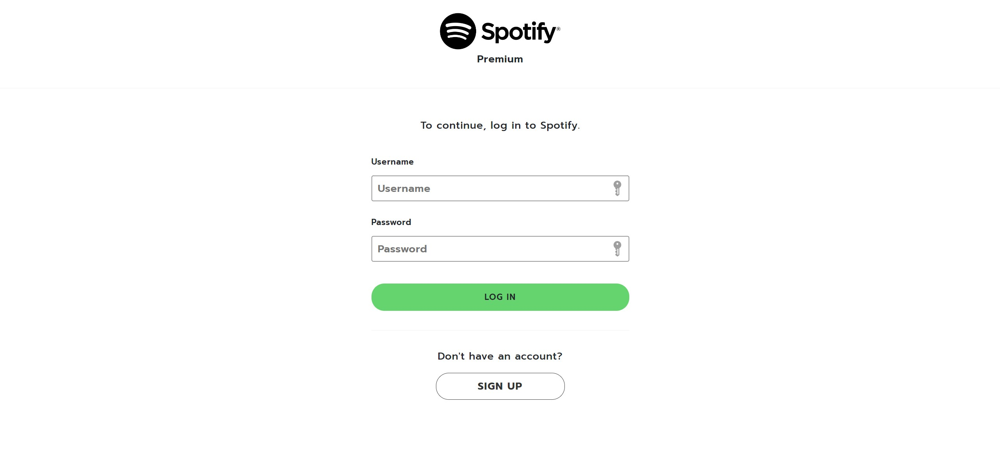
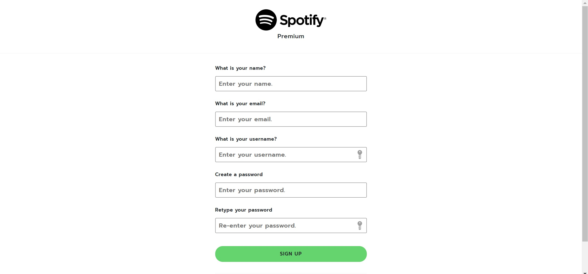
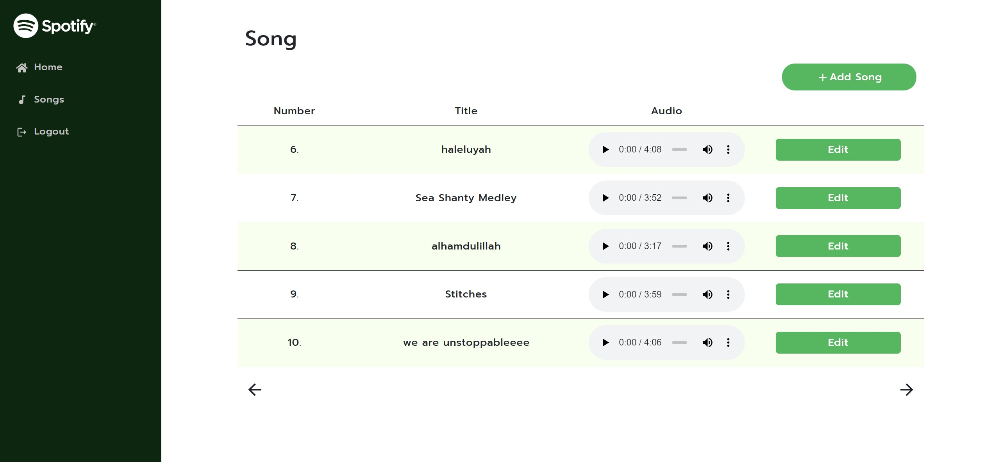
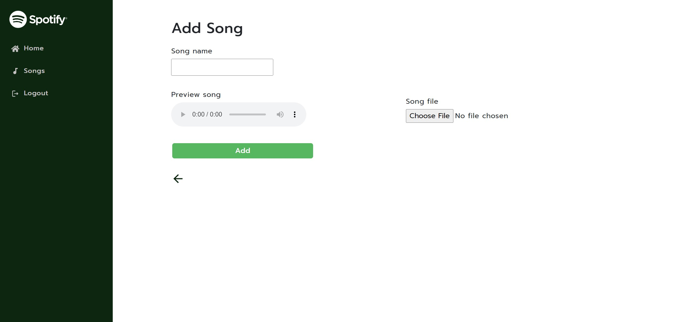
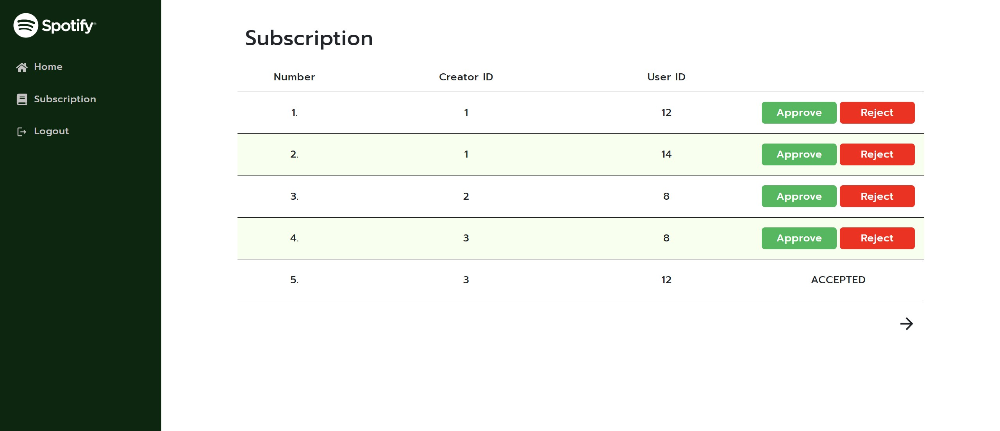

# Major Assignment 2 IF3110 Web Based Development 

## Description

This app is one of 4 repos we made for the major assignment. The other repos are:
- [Binotify App (PHP)](https://gitlab.informatika.org/if3110-2022-k01-02-22/binotify-app)
- [Binotify REST Service (Express)](https://gitlab.informatika.org/if3110-2022-k01-02-22/Binotify-REST-Service)
- [Binotify SOAP Service (Java)](https://gitlab.informatika.org/if3110-2022-k01-02-22/binotify-soap-service)

This repository will serve as front-end for singer and admin to manage their songs and subscriptions. Mainly, it will communicate with REST service.

## To Run with Manually

1. Clone this repository (with either SSH or HTTP)

```
git clone git@gitlab.informatika.org:if3110-2022-k01-02-22/binotify-premium-app.git
```

2. Run ```npm install``` to install all requirements.
3. Run ```npm run dev```.


## To Run with Docker

```
docker build -t tubes-2-react:latest .
docker compose up
```

## Page Overviews
1. Login page


2. Register page 


3. Song list


4. Add/edit song


5. Subs list


## Authors
```
import React from "react";
export default function Authors() {
    return (
        <div className="authors-lists">
            <ul>
                <li>Primanda Adyatma Hafiz / 13520022</li>
                <li>Maria Khelli / 13520115</li>
                <li>Frederik Imanuel Louis / 13520163</li>
            </ul>
        </div>
    )
}
```

## Pembagian Tugas
- Login Page : 13520115
- Register Page : 13520115
- Home Page : 13520115
- Song list : 13520115, 13520022
- Song edit : 13520115
- Song add : 13520115
- Subscription approval : 13520115, 13520163