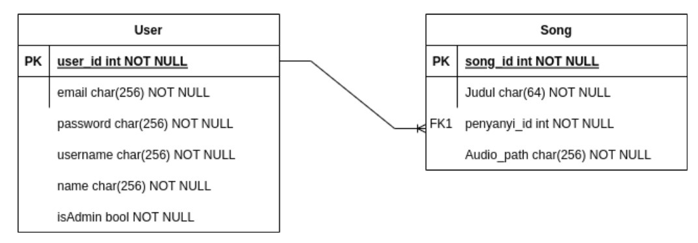

# Major Assignment 2 IF3110 Web Based Development 

## Description

This app is one of 4 repos we made for the major assignment. The other repos are:
- [Binotify App (PHP)](https://gitlab.informatika.org/if3110-2022-k01-02-22/binotify-app)
- [Binotify Premium App (React)](https://gitlab.informatika.org/if3110-2022-k01-02-22/binotify-premium-app)
- [Binotify SOAP Service (Java)](https://gitlab.informatika.org/if3110-2022-k01-02-22/binotify-soap-service)

This repository will serve several features for singer and admin to manage their songs and subscriptions. It will also act as a middleman for SOAP and React services. We use Express.js as the tech stack.

## To Run Manually

1. Clone this repository (with either SSH or HTTP)

```
git clone git@gitlab.informatika.org:if3110-2022-k01-02-22/Binotify-REST-Service.git
```

2. Run ```npm install``` to install all requirements.
3. Run ```npm start```.


## To Run with Docker
```
docker build -t tubes-2-rest:latest .
docker compose up
```

## Database Schema 



## Endpoints 

|Method, Path| Description|
|-|-|
| POST /api/register | Register for singer. Admin can only be granted from devs |
| POST /api/login | Login for singer and admin |
| GET /api/check_login | Check login if already have JWT |
| GET /api/song | Get song for specific singer |
| POST /api/song/add | Add song for specific singer (with JWT) |
| PUT /api/song/update/:song_id  | Update song for specific singer  |
| DELETE /api/song/delete/:song_id | Delete song for specific singer |
| GET /api/singer | Get all singers |
| GET /api/songuser | Get song by user (with query params) |
| GET /api/songblob | Get url for song |
| POST /api/songblob | Upload url for song |
| GET /api/subscription/pending | Get list of pending subs |
| PUT /api/subscription/verify | Update subscription |

## Authors 

```javascript
const express = require("express");
const app = express();
app.get("/authors", function (req, res) {
    res.status(200);
    res.send({
        "authors": [
            "Primanda Adyatma Hafiz / 13520022",
            "Maria Khelli / 13520115",
            "Frederik Imanuel Louis / 13520163"
        ]
    })
})
```

## Pembagian Tugas
- Register : 13520115
- Login : 13520115
- Check Login : 13520115
- Singer's song list by binotify app user : 13520022
- Create, update, delete song : 13520022
- Singer List : 13520163
- Singer's song list : 13520022
- Send song file : 13520115
- List subscription : 13520022
- Approve subscription : 13520022
- Redis : 13520163
- Docker : 13520022