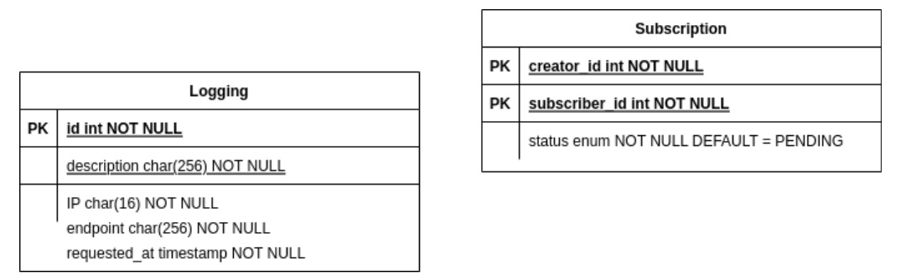

# Major Assignment 2 IF3110 Web Based Development

## Description

This app is one of 4 repos we made for the major assignment. The other repos are:
- [Binotify App (PHP)](https://gitlab.informatika.org/if3110-2022-k01-02-22/binotify-app)
- [Binotify Premium App (React)](https://gitlab.informatika.org/if3110-2022-k01-02-22/binotify-premium-app)
- [Binotify REST Service (Express.js)](https://gitlab.informatika.org/if3110-2022-k01-02-22/Binotify-REST-Service)

This repository will serve as an API for subscription logic. With each hit, the service will logs it to the DB.

## Database Schema



## Endpoints

|Method, Path| Description|
|-|-|
| POST /verify | Check status of subscription |
| POST /approve | Approve or reject user's subscription and get pending request list |
| POST /subscribe | User request for subscription |

## Authors

```java
<Envelope xmlns="http://schemas.xmlsoap.org/soap/envelope/">
    <Body>
        <request xmlns="http://authors/">
            <arg0 xmlns="">Primanda Adyatma Hafiz / 13520022</arg0>
            <arg1 xmlns="">Maria Khelli / 13520115</arg1>
            <arg2 xmlns="">Frederik Imanuel Louis / 13520163</arg2>
        </request>
    </Body>
</Envelope>
```

## Pembagian Tugas
- Verify service: 13520163
- Approve request service: 13520022, 13520163
- Pending request list service: 13520163
- Subscribe request service: 13520163
- Logging: 13520115, 13520163
- API key: 13520163
- Mailer: 13520115
- Request approval callback: 13520022
- Docker: 13520163
